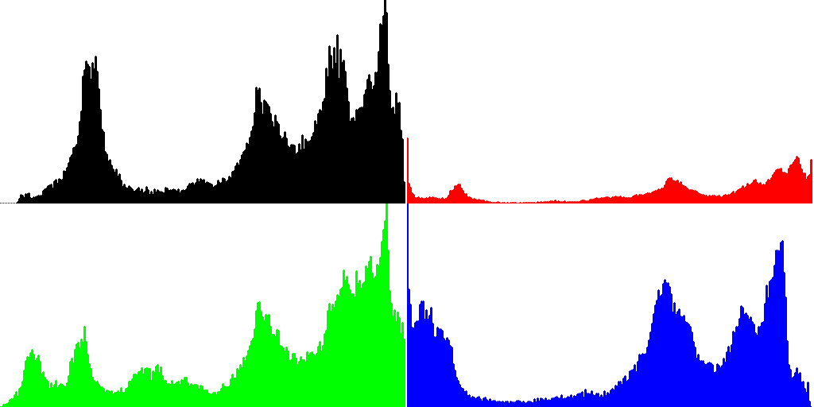

## Работа 2. Исследование каналов и JPEG-сжатия
автор: Федоров Илья Андреевич БПМ-19-1
дата: 2022-02-24T19:06:42

<!-- url: https://gitlab.com/2021-misis-spring/polevoy_d_v/-/tree/master/prj.labs/lab02 -->

### Задание
1. В качестве тестового использовать изображение data/cross_0256x0256.png
2. Сохранить тестовое изображение в формате JPEG с качеством 25%.
3. Используя cv::merge и cv::split сделать "мозаику" с визуализацией каналов для исходного тестового изображения и JPEG-версии тестового изображения.
- левый верхний - трехканальное изображение.
- левый нижний - монохромная (черно-зеленая) визуализация канала G.
- правый верхний - монохромная (черно-красная) визуализация канала R.
- правый нижний - монохромная (черно-синяя) визуализация канала B.
4. Результаты сохранить для вставки в отчет.
5. Сделать мозаику из визуализации гистограммы для исходного тестового изображения и JPEG-версии тестового изображения, сохранить для вставки в отчет.

### Результаты


Рис. 1. Тестовое изображение после сохранения в формате JPEG с качеством 25%


Рис. 2. Визуализация каналов исходного тестового изображения


Рис. 3. Визуализация каналов JPEG-версии тестового изображения


Рис. 3. Визуализация гистограм исходного и JPEG-версии тестового изображения

### Текст программы

```cpp
#include <opencv2/opencv.hpp>
#include <vector>

using namespace cv;

int main() {
	Mat gray_image = imread("C:/fedorov_i_a/data/cross_0256x0256.png", IMREAD_GRAYSCALE);
	Mat rgb_image = imread("C:/fedorov_i_a/data/cross_0256x0256.png");
	imwrite("cross_0128x0128.jpg", rgb_image, { IMWRITE_JPEG_QUALITY, 25 });
	Mat img025 = imread("cross_0128x0128.jpg");

	int hist_size = 256;
	float range[] = { 0, 256 };
	const float* hist_range = { range };
	int hist_w = 512, hist_h = 256;

	Mat bgr[3];
	split(rgb_image, bgr);
	Mat image_ch(512, 512, CV_8UC3);
	Mat gray_image3;
	cvtColor(gray_image, gray_image3, COLOR_GRAY2BGR);

	Mat color[3], g = Mat::zeros(Size(256, 256), CV_8UC1);
	merge(std::vector<Mat>({ bgr[0], g, g }), color[0]);
	merge(std::vector<Mat>({ g, bgr[1],g }), color[1]);
	merge(std::vector<Mat>({ g, g, bgr[2] }), color[2]);

	gray_image3.copyTo(image_ch(Rect(0, 0, 256, 256)));
	color[0].copyTo(image_ch(Rect(256, 256, 256, 256)));
	color[1].copyTo(image_ch(Rect(0, 256, 256, 256)));
	color[2].copyTo(image_ch(Rect(256, 0, 256, 256)));
	imwrite("cross_0256x0256_png_rgb_channels.png", image_ch);

	Mat gray_hist, b_hist, g_hist, r_hist;

	calcHist(&gray_image, 1, 0, Mat(), gray_hist, 1, &hist_size, &hist_range, true, false);
	calcHist(&bgr[0], 1, 0, Mat(), b_hist, 1, &hist_size, &hist_range, true, false);
	calcHist(&bgr[1], 1, 0, Mat(), g_hist, 1, &hist_size, &hist_range, true, false);
	calcHist(&bgr[2], 1, 0, Mat(), r_hist, 1, &hist_size, &hist_range, true, false);

	Mat gray_hist_img(hist_h, hist_w, CV_8UC3, Scalar(255, 255, 255));
	Mat blue_hist_img(hist_h, hist_w, CV_8UC3, Scalar(255, 255, 255));
	Mat green_hist_img(hist_h, hist_w, CV_8UC3, Scalar(255, 255, 255));
	Mat red_hist_img(hist_h, hist_w, CV_8UC3, Scalar(255, 255, 255));

	normalize(gray_hist, gray_hist, 0, gray_hist_img.rows, NORM_MINMAX, -1, Mat());
	normalize(b_hist, b_hist, 0, blue_hist_img.rows, NORM_MINMAX, -1, Mat());
	normalize(g_hist, g_hist, 0, green_hist_img.rows, NORM_MINMAX, -1, Mat());
	normalize(r_hist, r_hist, 0, red_hist_img.rows, NORM_MINMAX, -1, Mat());

	for (int i = 1; i < hist_size; i++)
	{
		line(gray_hist_img, Point((i - 1) << 1, hist_h - cvRound(gray_hist.at<float>(i - 1))), Point((i - 1) << 1, 512), Scalar(0, 0, 0), 2, 0);
		line(blue_hist_img, Point((i - 1) << 1, hist_h - cvRound(b_hist.at<float>(i - 1))), Point((i - 1) << 1, 512), Scalar(255, 0, 0), 2, 0);
		line(green_hist_img, Point((i - 1) << 1, hist_h - cvRound(g_hist.at<float>(i - 1))), Point((i - 1) << 1, 512), Scalar(0, 255, 0), 2, 0);
		line(red_hist_img, Point((i - 1) << 1, hist_h - cvRound(r_hist.at<float>(i - 1))), Point((i - 1) << 1, 512), Scalar(0, 0, 255), 2, 0);
	}

	Mat src_img_hists(hist_h * 2, hist_w * 2, CV_8UC3, Scalar(255, 0, 0));
	gray_hist_img.copyTo(src_img_hists(Rect(0, 0, hist_w, hist_h)));
	blue_hist_img.copyTo(src_img_hists(Rect(hist_w, hist_h, hist_w, hist_h)));
	green_hist_img.copyTo(src_img_hists(Rect(0, hist_h, hist_w, hist_h)));
	red_hist_img.copyTo(src_img_hists(Rect(hist_w, 0, hist_w, hist_h)));
	imwrite("cross_0256x0256_hists.png", src_img_hists);

	Mat gray_img025 = imread("cross_0128x0128.jpg", IMREAD_GRAYSCALE);
	Mat bgr025[3];
	split(img025, bgr025);
	Mat gray_hist025, blue_hist025, green_hist025, red_hist025;

	calcHist(&gray_img025, 1, 0, Mat(), gray_hist025, 1, &hist_size, &hist_range, true, false);
	calcHist(&bgr025[0], 1, 0, Mat(), blue_hist025, 1, &hist_size, &hist_range, true, false);
	calcHist(&bgr025[1], 1, 0, Mat(), green_hist025, 1, &hist_size, &hist_range, true, false);
	calcHist(&bgr025[2], 1, 0, Mat(), red_hist025, 1, &hist_size, &hist_range, true, false);

	Mat gray_hist_img025(hist_h, hist_w, CV_8UC3, Scalar(255, 255, 255));
	Mat blue_hist_img025(hist_h, hist_w, CV_8UC3, Scalar(255, 255, 255));
	Mat green_hist_img025(hist_h, hist_w, CV_8UC3, Scalar(255, 255, 255));
	Mat red_hist_img025(hist_h, hist_w, CV_8UC3, Scalar(255, 255, 255));
	normalize(gray_hist025, gray_hist025, 0, gray_hist_img025.rows, NORM_MINMAX, -1, Mat());
	normalize(blue_hist025, blue_hist025, 0, blue_hist_img025.rows, NORM_MINMAX, -1, Mat());
	normalize(green_hist025, green_hist025, 0, green_hist_img025.rows, NORM_MINMAX, -1, Mat());
	normalize(red_hist025, red_hist025, 0, red_hist_img025.rows, NORM_MINMAX, -1, Mat());

	for (int i = 1; i < hist_size; i++)
	{
		line(gray_hist_img025, Point((i - 1) << 1, hist_h - cvRound(gray_hist025.at<float>(i - 1))), Point((i - 1) << 1, 512), Scalar(0, 0, 0), 2, 0);
		line(blue_hist_img025, Point((i - 1) << 1, hist_h - cvRound(blue_hist025.at<float>(i - 1))), Point((i - 1) << 1, 512), Scalar(255, 0, 0), 2, 0);
		line(green_hist_img025, Point((i - 1) << 1, hist_h - cvRound(green_hist025.at<float>(i - 1))), Point((i - 1) << 1, 512), Scalar(0, 255, 0), 2, 0);
		line(red_hist_img025, Point((i - 1) << 1, hist_h - cvRound(red_hist025.at<float>(i - 1))), Point((i - 1) << 1, 512), Scalar(0, 0, 255), 2, 0);
	}

	Mat src_img_hists025(hist_h * 2, hist_w * 2, CV_8UC3, Scalar(255, 0, 0));
	gray_hist_img025.copyTo(src_img_hists025(Rect(0, 0, hist_w, hist_h)));
	blue_hist_img025.copyTo(src_img_hists025(Rect(hist_w, hist_h, hist_w, hist_h)));
	green_hist_img025.copyTo(src_img_hists025(Rect(0, hist_h, hist_w, hist_h)));
	red_hist_img025.copyTo(src_img_hists025(Rect(hist_w, 0, hist_w, hist_h)));
	imwrite("cross_0128x0128_hists.png", src_img_hists025);

	Mat color025[3];
	merge(std::vector<Mat>({ bgr025[0], g, g }), color025[0]);
	merge(std::vector<Mat>({ g, bgr025[1],g }), color025[1]);
	merge(std::vector<Mat>({ g, g, bgr025[2] }), color025[2]);

	Mat image_ch025(512, 512, CV_8UC3);
	Mat gray_image_025;
	cvtColor(gray_img025, gray_image_025, COLOR_GRAY2BGR);
	gray_image_025.copyTo(image_ch025(Rect(0, 0, 256, 256)));
	color025[0].copyTo(image_ch025(Rect(256, 256, 256, 256)));
	color025[1].copyTo(image_ch025(Rect(0, 256, 256, 256)));
	color025[2].copyTo(image_ch025(Rect(256, 0, 256, 256)));
	imwrite("cross_0128x0128_jpg_rgb_channels.png", image_ch025);

	waitKey(0);
	return 0;
}
```
